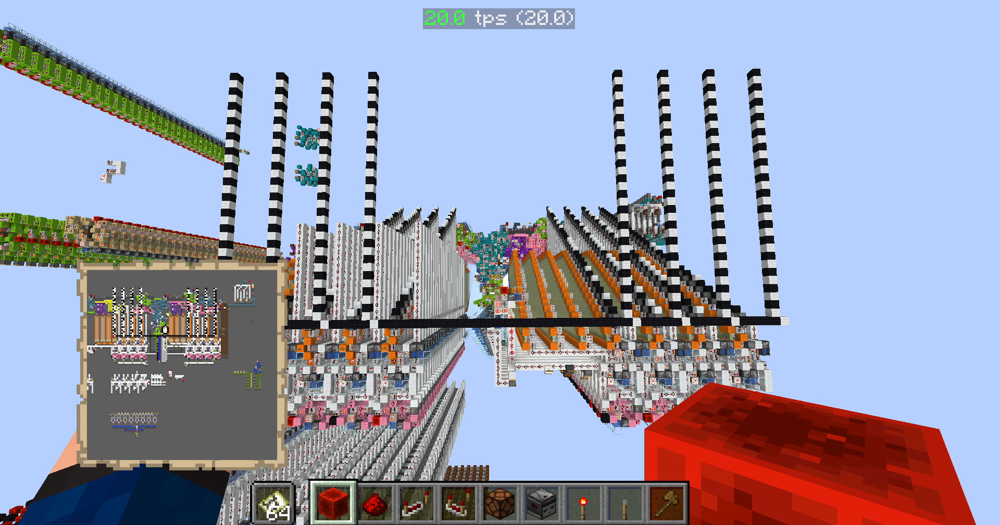

# Minecraft Bitcoin Miner Tools

## Helpful resources on SHA256

- <https://sha256algorithm.com/> - an interactive tool that visually shows the inner-working of SHA256.
- [Official definition of SHA256](https://csrc.nist.gov/files/pubs/fips/180-2/upd1/final/docs/fips180-2withchangenotice.pdf)

## data_in

This is a prototype for getting data into the game using an AutoHotKey script. generator.py takes bytes and converts them into a string representing a big-endian 32-bit integer.

## data_out

A debug tool for quickly getting data out of the game. It converts in-game structures using binary representation to `int`s in Python by reading pixel data from a screenshot. It uses a starting pixel and guides as defined in /data_out/config.json. Right now, we're using it to convert all the working variables to pretty-printed hexidecimal.

This screenshot:  produces this result:

```text
a: 47 5d 72 67
b: db cc 4c fd 
c: cf 72 d0 85 
d: 1f 1b c7 57 
e: 25 0f 0a 8e 
f: d5 ef b4 92 
g: 87 cd b6 b4 
h: 04 4c 04 01
```

## SHA256

This is a quick implementation of SHA256 in Python. I wrote this to make sure I knew the algorithm well enough to build it consistently in Minecraft. It's a lot easier to fix logical errors in Python than it is in Minecraft, where everything if effectively hard-wired.

## hexifier.js

For debugging we've been making use of this website <https://sha256algorithm.com/>. However, it displays everything in binary. To make it easier to compare 32-bit numbers, I wrote a little JavaScript function that can convert all the binary numbers into hexidecimal. This can interfere somewhat with the functionality, but as long as you navigate to the stage in the algorithm and then call the function, all the results should be accurate.
